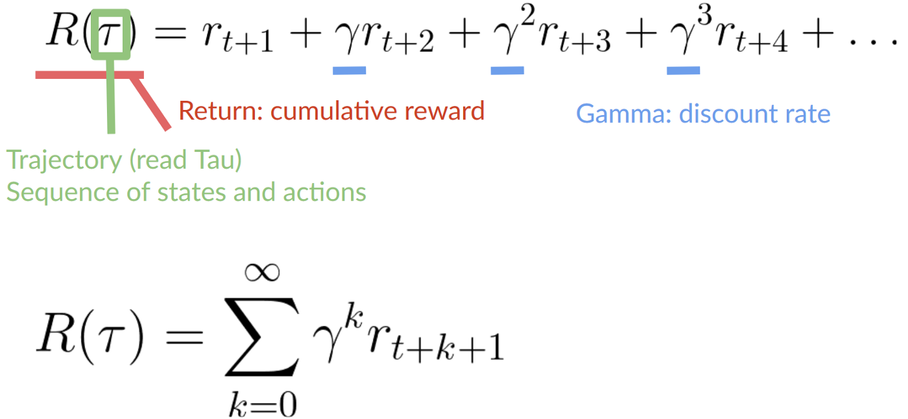

# DRL-Course 🤖🕹️🌎💰

[Huggingface Deep Reiforcement Learning Course](https://huggingface.co/deep-rl-course/unit0/introduction) 🤗

## Unit 1. Introduction to DRL
- A sequence of state, action, reward and next state. The expected return.
- Markov Decision Process (MDP): the agent needs **only the current state to decide what action to take** and not the history of all the states and actions (trajectory), according to Markov property
- State (chess ♟️👑) and observation (Super Mario 👨🏻‍🔧🍄)
- Actions in discrete (Mario👨🏻‍🔧🍄) or continious (Tesla 🚙🖥️) space

Reward (🧀) is the only feedback for the agent (🐹). Cumulative reward, trajectory (τ-tau), discounting (γ-gamma).

**Discounting the rewards**:
1. Discount rate must be 0 < γ < 1 (or 0≤γ≤1?),  most of time 0.99≤γ≤0.95
- larger gamma -> smaller discount: the long-term reward
- smaller gamma -> bigger discount: the short-term reward
2. Each reward is discounted by gamma to the exponent of the time step. Time step increases -> future reward is less and less likely to happen

**Tasks**: 
- Episodic (start and end points 🏁🔚, Mario👨🏻‍🔧🍄)
- Continuing (no terminal state ∞, stock market🚀🔪)

**Exploration/Exploitation trade-off**:
- Exploitation: exploiting known information to maximize the reward (going every day to the same restaurat that is just good 🍔🥡🍕)
- Exploration: exploring the environment by trying random actions in order to find more information about the environment (try a new restaurand risking to have a bad experience 🤢💩🍄 but the probable opportunity of a fantastic experience 🥘😋🤤)

**The Policy π** is the function that tells the agent what action to take given the current state: State -> π(State) -> Action
The two approaches to train the agent to find the optimal policy π 🧠🤔💻:
- Directly, Policy-Based Methods ⬇🔙🔝
- Indirectly, Value-Based Methods 🏆💰📈

**Policy-Based Methods**: training a policy fucntion, mapping between each state and the best corresponding action. Types: 
- Deterministic: `action = policy(state)`, returns the the same action at a given state
- Stochastic: `policy(actions | state) = probability distribution` over the set of actions given the current state

**Value-based methods**: training a value function, mapping a state to the expected value of being at that state. The main idea is “going to the state with the highest value”: 

**But where is the “Deep” in Reinforcement Learning?!**

**Deep**: use deep neural networks to estimate the action to take (policy-based) or to estimate the value of a state (value-based) 😏

## Unit 2. Introduction to Q-learning

- value-based methods
- differences between Monte Carlo and Temporal Difference Learning
- RL algorithm: Q-Learning

**Find best policy π 🧠🤔💻**

There is always a policy. Optimal policy is π*. Optimal value function is Q or V (applied only to value-based methods).

- Policy-Based methods ⬇🔙🔝: train the policy, the policy is a NN, no value function. π* is found by training the policy directly.
- Value-Based methods 🏆💰📈: do not train the policy, the policy is a funсtion defined by hand, instead train a value-funсtion that is a NN. Find the optimal value function -> have an optimal policy, `π*(s)=arg max_a Q*(s, a)`
  - state-value function 🧘 (`V_π(s)`): for each state, the state-value function outputs the expected return if the agent starts at that state and then follows the policy forever after(for all future timesteps). **Calculate the value of state S_t**
  - action-value function 🏃‍ (`Q_π(s, a)`): for each state and action pair, the action-value function outputs the expected return if the agent starts in that state and takes action, and then follows the policy forever after. **Calculate the value of state-action pair (S_t, A_t)**
  
Thus, to calculate EACH value of a state or a state-action pair -> expensive computationally 🖥️💰📈 -> Bellman equation! Recursion! So math, such science! ❤️🤓

**The Bellman equation**: instead of calculating each value as the sum of the expected return, sum immediate reward + the discounted value of the state that follows.

**How to train value function or policy function: two ~~chairs~~ strategies**
- Monte Carlo: needs a complete episode of interaction before updating our value function (there is the actual accurate discounted return of this episode)
- Temporal Difference Learning: uses only a step (one interaction, no experience of entire episode, no return, only an estimated return called TD target) 

**Q-Learning**

Q-Learning is an off-policy value-based method that uses a TD approach to train its action-value function (whatever it means)

...to be continued 🐌🐌🐌

